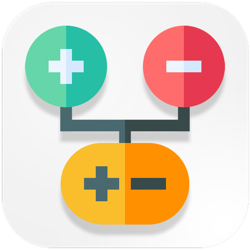
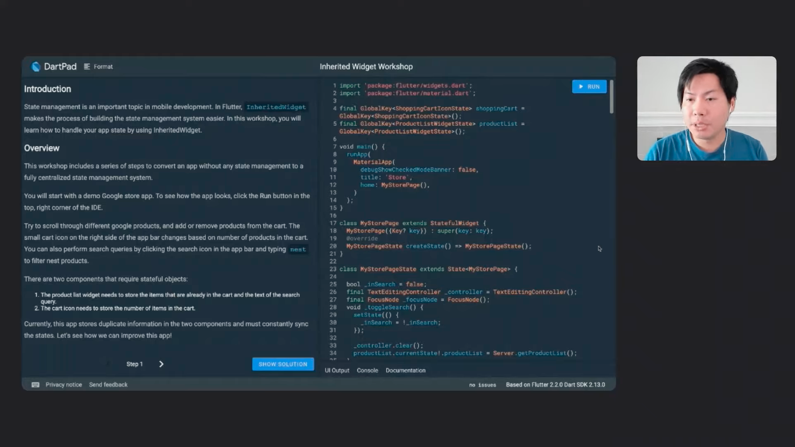

&nbsp;&nbsp;
&nbsp;&nbsp;
<a href="https://choosealicense.com/licenses/mit/" target="_blank"></a>&nbsp;&nbsp;
&nbsp;&nbsp;


# Inherited Widget Workshop

</img>
Learn how to use inherited widgets to implement your own state management solutions. With a sample flutter application, we go through the steps needed to implement a state management system.

This lab requires knowledge of building the Flutter UI using basic stateless and/or stateful widgets.

Resources:
Inherited Widget workshop → [here](https://dartpad.dev/workshops.html?webserver=https://dartpad-workshops-io2021.web.app/inherited_widget&utm_source=google-io21&utm_medium=referral&utm_campaign=io21-resources)

## Video Workshop
<p align="center">
<a href="https://www.youtube.com/watch?v=LFcGPS6cGrY&t=38s" target="_blank"></a>
</p>

## App Demo

<p align="center"></p>

## File Pattern Inside The `lib` Folder

```
lib
├── server
│   └── server.dart
├── view
│   ├── widget
│   │   └── product_tile.dart
│   └── store_page.dart
└── main.dart
```
